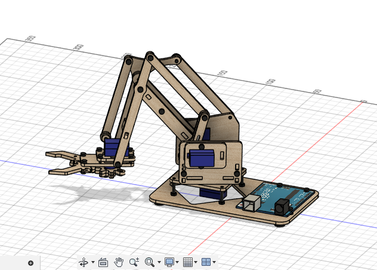

# Version 1 : Bras téléopéré par manettes

## Réalisation d’un bras robotique téléopéré par manettes

Il s’agit d’un  bras robotique assez connu  à 4 axes de taille réduite et  à mécanique très simple conçu dans l’objectif d’initier aux concepts basics de la robotique tels que : les degrés de liberté, la circuiterie électronique , la programmation avec Arduino etc…

#### Description mécanique

 Il s’agit d’un bras à 4 axes : Un servant à faire tourner la base, les deux suivant servant de levant et le dernier permettant  de fermer et d’ouvrir la [pince](http://pince.Il) , ces mouvements étant assurés par des servo moteurs.  La majorité de ses pièces ont été imprimés en 3D avec du PLA. 

  

#### Description Electronique

 Le bras est contrôlé à l’aide d’une carte arduino qui génère le signal PWM nécessaire au fonctionnement des servo. L’alimentation des moteurs ainsi que de la carte Arduino est assuré par un DC supply réglé sur une tension de 5v . 

**Liste des composants** 

- Arduino
- Câbles
- Servo moteur SG90
- Joysticks

**Schéma électronique :** 

                                            Schéma descriptif de la circuiterie du système. 

### Programme

Chaque moteur est contrôlé par un axe de joystick . Le rôle du joystick ici est de générer un signal analogique en fonction du mouvement de l’analogue. ( Voir le lien décrivant le fonctionnement d’un joystick en annexe). Ce signal est reçu sur l’une des broches analogiques (A0 à A1)  de l’Arduino est utilisé pour faire varier les angles des servo moteurs.

### Liens utiles :

Comprendre et programmer un servo moteur : [https://www.moussasoft.com/sg90-servo-moteur-arduino/](https://www.moussasoft.com/sg90-servo-moteur-arduino/)

Utilisation d’un joystick avec arduino : [https://www.aranacorp.com/fr/utilisation-dun-joystick-avec-arduino/](https://www.aranacorp.com/fr/utilisation-dun-joystick-avec-arduino/)