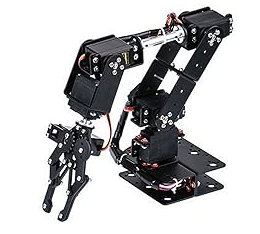
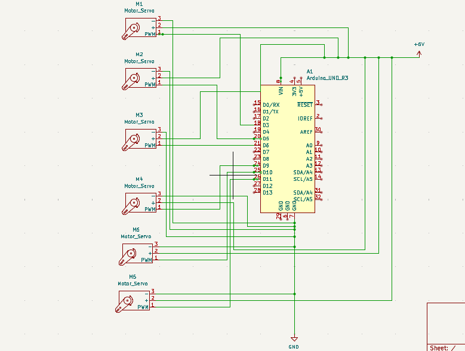
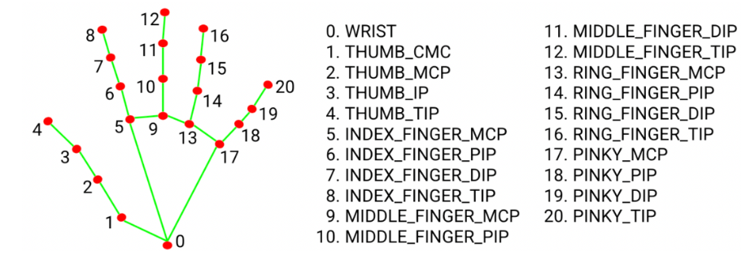
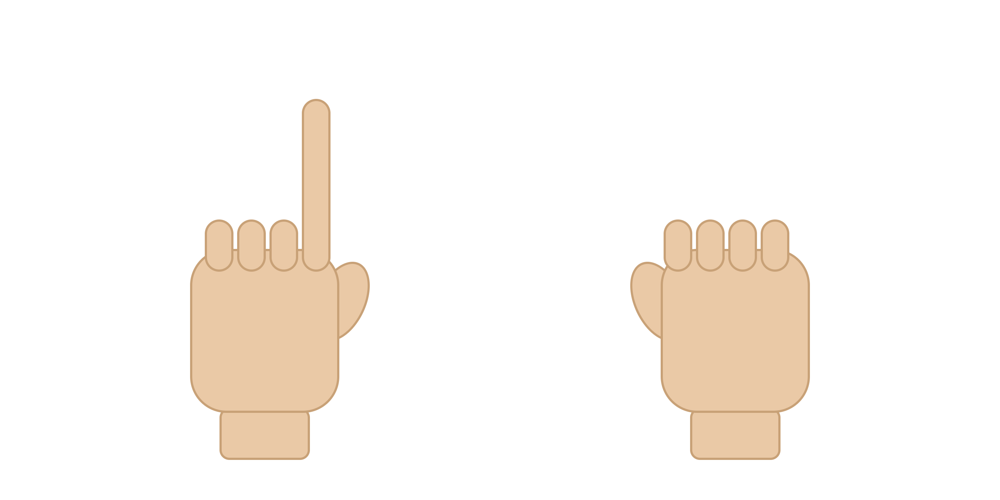
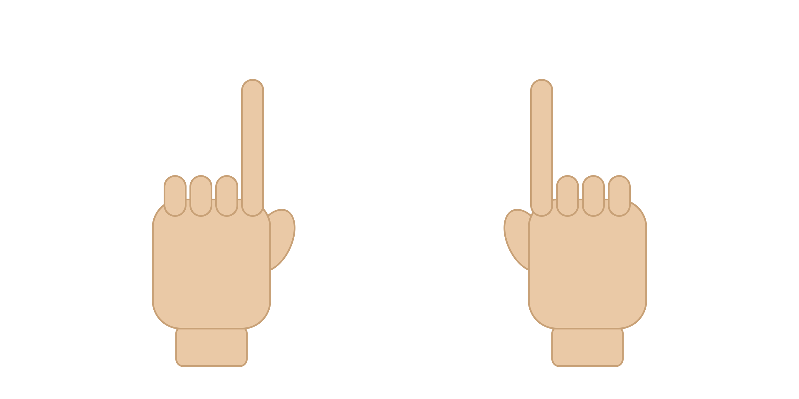
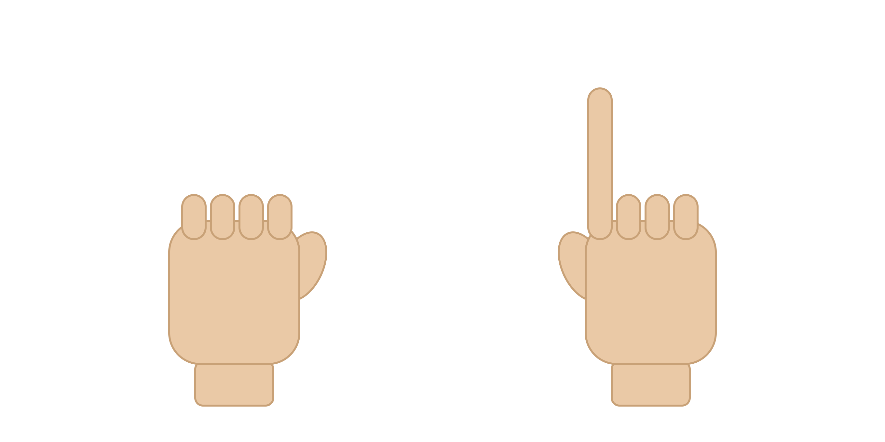

# Version 2 : Bras téléopéré par mouvements de la main

### Volet mécanique :

Il s’agit d’un bras en métal à 6 axes (Non conçu par nous même) ne possédant que des joint de type revolute . Sa longueur maximale est de 50cm environ et les mouvements des différents liens  sont gérés par des servo moteurs MG995 . 

### Volet Electronique :

 Les servo sont alimentés avec du 6v et sont contrôlés par une carte arduino uno comme précédemment. Ici se présente le circuit effectué  

  

### Volet informatique :

 Il est contrôlé par des mouvements de la main que nous avons défini . Le code écrit en python utilise trois bibliothèques : opencv pour le traitement d’images, mediapipe pour la traduction des mouvements de la main à l’ordinateur ( à l’aide d’un modèle d’IA pré entraîné) puis pyfirmata qui permet de contrôler des composants électroniques ( les servo moteurs dans notre cas) en python . Deux codes permettent de le contrôler : Un code arduino à téléverser sur la carte arduino auxquels sont branchés les servo moteurs et un code python à exécuter sur ordinateur . 

### Fonctionnement :

La bibliothèque Média pipe permet de repérer différents points d’une main en plaçant des Landmark : 

On vérifie à chaque fois si un doigt est levé en calculant la distance qui sépare le poignet  des différentes articulations du doigt (MCP et TIP ). Par exemple pour vérifier si l’index est levé ou pas on compare les distances a ( distance entre 0 et 5)  et b (distance entre 0 et 8) . Si il est levé alors a<b si non c’est le contraire .

Avec ce principe , on associe des doigts à chaque moteur du bras de sorte que si un doigt est levé , le moteur associé bouge en augmentant son angle et si le doigt est baissé il bouge dans le sens inverse . Mais cette méthode a un problème : il ne permet pas d’arrêter le mouvement car vu que l’une des conditions a≤b et b≤a est toujours réalisé à tout instant soit l’angle est incrémenté ou soit il est décrémenté n’ayant pas la possibilité de s’immobiliser . 

Pour résoudre ce problème , des autorisations ont été ajouté . L’idée c’est d’utiliser les deux mains pour le contrôle de sorte que pour bouger un moteur on lève ( ou baisse ) le doigt de la main droite correspondant mais ce mouvement n’est permis que si le doigt de la main gauche associé est levé . Ainsi pour arrêter le mouvement il suffira de baissé le doigt gauche associé . 

Exemple visuel : 

Gauche levé et droite baissé : décrémente 

gauche levé et droite levé : incrémente 

gauche baissé et droite levé : le moteur ne bouge pas 

                                                               Deux doigts baissés : rien ne bouge

### Liens utiles :

Débuter avec médiapipe : 

[https://developers.google.com/edge/mediapipe/solutions/vision/hand_landmarker](https://developers.google.com/edge/mediapipe/solutions/vision/hand_landmarker)

[https://developers.google.com/edge/mediapipe/solutions/vision/hand_landmarker/python](https://developers.google.com/edge/mediapipe/solutions/vision/hand_landmarker/python)

Py firmata : 

[https://forum.arduino.cc/t/cours-sur-pyfirmata-arduino/691568](https://forum.arduino.cc/t/cours-sur-pyfirmata-arduino/691568)