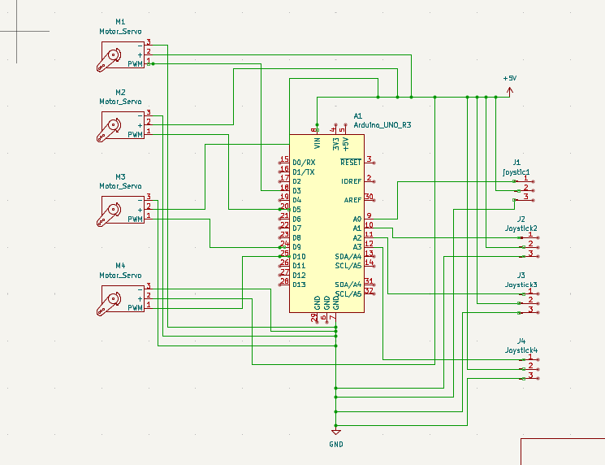

# Version 1 : Bras téléopéré par manettes

## Réalisation d'un bras robotique téléopéré par manettes

Il s'agit d'un bras robotique assez connu à 4 axes de taille réduite et à mécanique très simple, conçu dans l'objectif d'initier aux concepts basiques de la robotique tels que : les degrés de liberté, la circuiterie électronique, la programmation avec Arduino, etc.

#### Description mécanique

Il s'agit d'un bras à 4 axes : un servant à faire tourner la base, les deux suivants servant de levier et le dernier permettant de fermer et d'ouvrir la pince, ces mouvements étant assurés par des servomoteurs. La majorité de ses pièces ont été imprimées en 3D avec du PLA.

#### Description électronique

Le bras est contrôlé à l'aide d'une carte Arduino qui génère le signal PWM nécessaire au fonctionnement des servos. L'alimentation des moteurs ainsi que de la carte Arduino est assurée par une alimentation DC réglée sur une tension de 5V.

**Liste des composants**

- Arduino
- Câbles
- Servomoteur SG90
- Joysticks

**Schéma électronique :**

<em>Schéma descriptif de la circuiterie du système.</em>

### Programme

Chaque moteur est contrôlé par un axe de joystick. Le rôle du joystick ici est de générer un signal analogique en fonction du mouvement de l'analogue (voir le lien décrivant le fonctionnement d'un joystick en annexe). Ce signal est reçu sur l'une des broches analogiques (A0 à A1) de l'Arduino et est utilisé pour faire varier les angles des servomoteurs.

### Liens utiles

- [Comprendre et programmer un servomoteur (SG90)](https://www.moussasoft.com/sg90-servo-moteur-arduino/)
- [Utilisation d'un joystick avec Arduino](https://www.aranacorp.com/fr/utilisation-dun-joystick-avec-arduino/)
