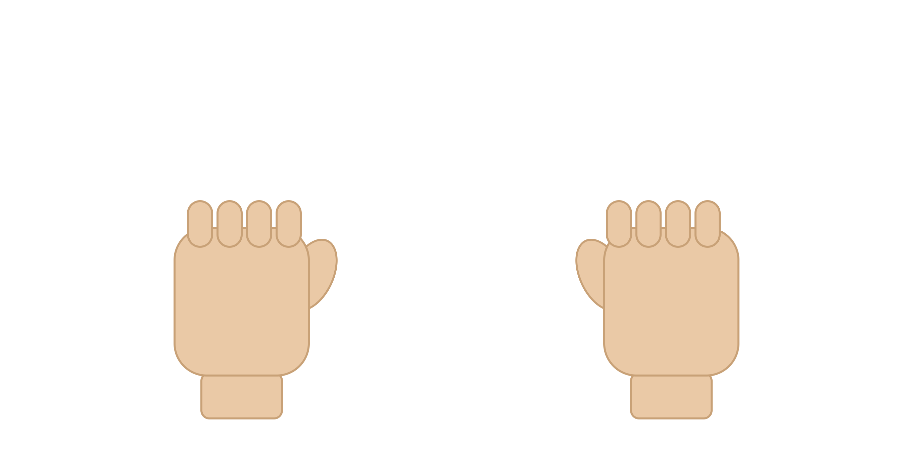

# Version 2 : Bras téléopéré par mouvements de la main

### Volet mécanique

Il s'agit d'un bras en métal à 6 axes (non conçu par nous-mêmes) ne possédant que des joints de type révolute. Sa longueur maximale est d'environ 50 cm et les mouvements des différents liens sont gérés par des servomoteurs MG995.

### Volet électronique

Les servos sont alimentés en 6V et sont contrôlés par une carte Arduino Uno comme précédemment. Voici le circuit réalisé :

### Volet informatique

Le bras est contrôlé par des mouvements de la main que nous avons définis. Le code écrit en Python utilise trois bibliothèques : **OpenCV** pour le traitement d'images, **MediaPipe** pour la traduction des mouvements de la main à l'ordinateur (à l'aide d'un modèle d'IA pré-entraîné), puis **PyFirmata** qui permet de contrôler des composants électroniques (les servomoteurs dans notre cas) en Python. Deux codes permettent de le contrôler : un code Arduino à téléverser sur la carte à laquelle sont branchés les servomoteurs, et un code Python à exécuter sur l'ordinateur.

### Fonctionnement

La bibliothèque MediaPipe permet de repérer différents points d'une main en plaçant des landmarks :

On vérifie à chaque fois si un doigt est levé en calculant la distance qui sépare le poignet des différentes articulations du doigt (MCP et TIP). Par exemple, pour vérifier si l'index est levé ou non, on compare les distances **a** (distance entre les points 0 et 5) et **b** (distance entre les points 0 et 8). S'il est levé alors a < b, sinon c'est l'inverse.

Avec ce principe, on associe des doigts à chaque moteur du bras de sorte que si un doigt est levé, le moteur associé bouge en augmentant son angle, et si le doigt est baissé, il bouge dans le sens inverse. Mais cette méthode pose un problème : elle ne permet pas d'arrêter le mouvement, car l'une des conditions (a ≤ b ou b ≤ a) est toujours vérifiée à tout instant — soit l'angle est incrémenté, soit il est décrémenté, sans possibilité de s'immobiliser.

Pour résoudre ce problème, des autorisations ont été ajoutées. L'idée est d'utiliser les deux mains pour le contrôle : pour bouger un moteur, on lève (ou baisse) le doigt de la main droite correspondant, mais ce mouvement n'est permis que si le doigt de la main gauche associé est levé. Ainsi, pour arrêter le mouvement, il suffit de baisser le doigt gauche associé.

**Exemple visuel :**

<em>Gauche levé et droite baissé : décrémente</em>

<em>Gauche levé et droite levé : incrémente</em>

<em>Gauche baissé et droite levé : le moteur ne bouge pas</em>

<em>Deux doigts baissés : rien ne bouge</em>

### Liens utiles

**Débuter avec MediaPipe :**

- [https://developers.google.com/edge/mediapipe/solutions/vision/hand_landmarker](https://developers.google.com/edge/mediapipe/solutions/vision/hand_landmarker)
- [https://developers.google.com/edge/mediapipe/solutions/vision/hand_landmarker/python](https://developers.google.com/edge/mediapipe/solutions/vision/hand_landmarker/python)

**PyFirmata :**

- [https://forum.arduino.cc/t/cours-sur-pyfirmata-arduino/691568](https://forum.arduino.cc/t/cours-sur-pyfirmata-arduino/691568)
